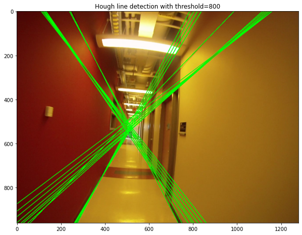

# ma-computer-vision
Selection of notebooks from a masters computer vision course undertaken at University of Helsinki in Autumn 2022. Includes 3 notebooks implementing Hough Line Detection, Manhattan Frames, Epipolar Lines, Camera and Fundamental Matrix calculation along with other essential Computer Vision techniques. 

CV2022_Ex3:
- Direct linear transform
- Hough line transform  

  
CV2022_Ex4:
- Manhattan frames
- Camera matrix calibration
- Vanishing points calculation 
  
CV2022_Ex5:
- Fundamental matrix
- Epipolar lines
