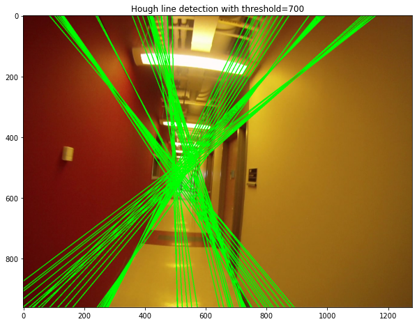
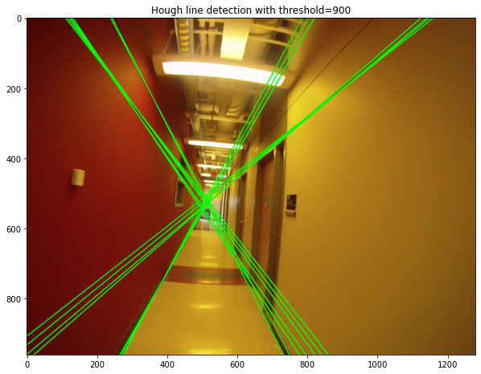
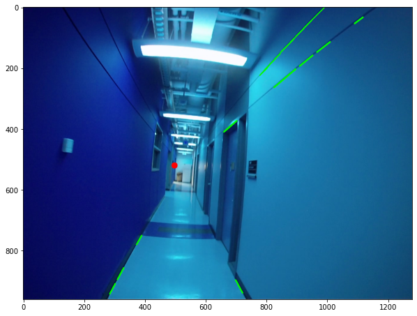
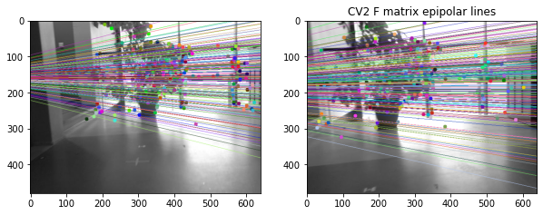

# ma-computer-vision
Selection of notebooks from a masters computer vision course undertaken at University of Helsinki in Autumn 2022. Includes 3 notebooks implementing Hough Line Detection, Manhattan Frames, Epipolar Lines, Camera and Fundamental Matrix calculation along with other essential Computer Vision techniques. 

CV2022_Ex3
- Direct linear transform
- Hough line transform  
  
CV2022_Ex4
- Manhattan frames
- Camera matrix calibration
- Vanishing points calculation 
  
CV2022_Ex5
- Fundamental matrix
- Epipolar lines

# Gallery
<h3>CV2022_Ex3</h3>
CV2 Canny edge detection    

   

   

Manual Hough line detection  

Manual direct linear transform: Epipolar lines

Manual direct linear transform: Image transformation

<h3>CV2022_Ex4</h3>

Vanishing points  

Manhattan frames 

<h3>CV2022_Ex5</h3>

Manual epipolar line detection using fundamental matrix F 

